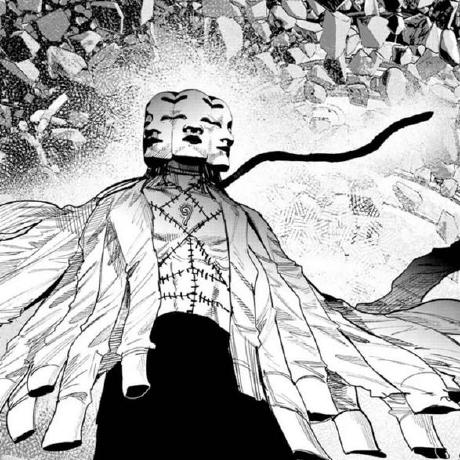

 

<table align="center">
<tr>
<td width="160" align="center" valign="top">

</td>
<td valign="top">

### 👋 About Me

- 🎓 Currently learning and building up my programming foundations
- 🤖 Exploring **AI / neural networks** — using them in everyday work and study
- 🌱 Growing my skills step by step, one project at a time
- 💡 Interested in how far AI tools can push what one person can build alone

</td>
</tr>
</table>

 

### 🔗 Connect with me

 

### 📊 GitHub Stats

 

### 🛠️ Languages & Tools

 

### 📈 Activity Graph

 

### ☕ Support Me

 

⚫⚪ Monochrome, minimal, focused — that's the vibe.

